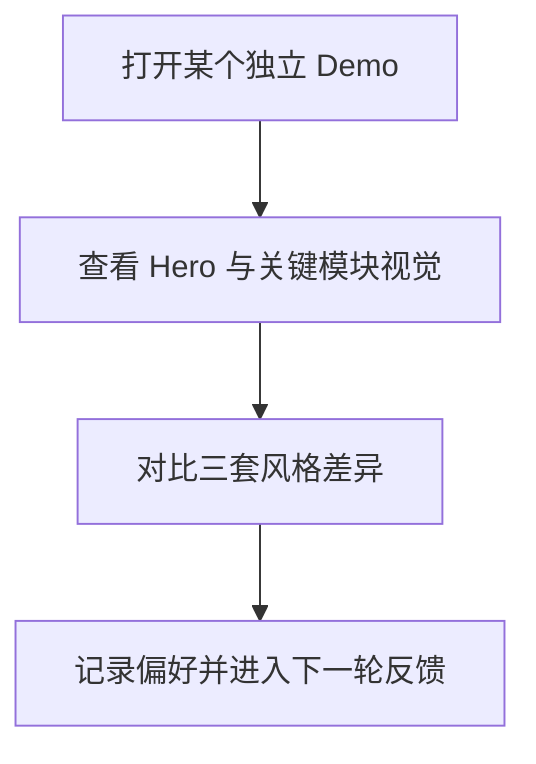

## 1. 产品概述
为现有情侣网站生成三个可随时删除的独立视觉风格 demo 页面，用于分别预览手帐风、电影剧场风、杂志风三套方向。
- 主要解决当前视觉方案缺少记忆点、风格选择难以判断的问题。
- 目标用户是网站维护者和设计协作者，用于后续交互式风格迭代，不作为正式首页上线设计。

## 2. 核心功能

### 2.1 功能模块
1. **手帐风 Demo 页面**：纸张纹理、胶带、票根、邮戳、便签式纪念模块。
2. **电影剧场风 Demo 页面**：深色幕布、电影海报、聚光灯、票根、胶片场景。
3. **杂志风 Demo 页面**：封面主视觉、目录、跨页专栏、贯穿式阅读动线。
4. **维护说明**：三个页面均为临时 demo，后续可直接删除，不影响现有 `index.html`。

### 2.2 页面详情
| 页面名称 | 模块名称 | 功能描述 |
| --- | --- | --- |
| 手帐风 Demo | 首页预览 | 展示纸张、票根、邮戳、手账卡片风格 |
| 电影剧场风 Demo | 首页预览 | 展示深色电影海报、胶片、票根和字幕条风格 |
| 杂志风 Demo | 首页预览 | 展示杂志封面、目录、跨页专栏和贯穿动线 |

## 3. 核心流程
用户分别打开三个 demo 页面，查看每套风格如何承载相同的 Chen & Gao 内容结构，再选择最接近后续正式首页的方向。

## 4. 用户界面设计

### 4.1 设计风格
- 三个页面互相独立，每套风格使用独立配色、字体、版式、装饰和动效语汇。
- 按钮、卡片、地图、日历和纪念日模块都做风格化缩略展示。

### 4.2 页面设计概览
| 页面名称 | 模块名称 | UI 元素 |
| --- | --- | --- |
| 手帐风 Demo | 拼贴首页 | 大标题、胶带照片、邮戳、便签、旅行票根 |
| 电影剧场风 Demo | 剧场首页 | 海报、聚光灯、票根、胶片片段、深色幕布 |
| 杂志风 Demo | 特刊首页 | 封面故事、目录、专栏、跨页地图、编号动线 |

### 4.3 响应式
桌面优先设计。宽屏下每套风格使用左右或多列构图；窄屏下改为单列堆叠，保证手机也能查看风格方向。
