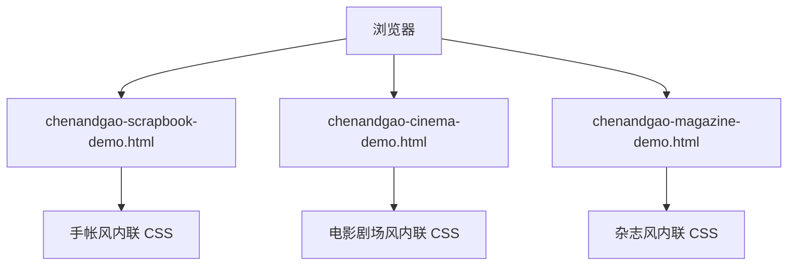

## 1. 架构设计
新增三个独立静态页面，不修改现有 `index.html` 的页面结构、样式和运行逻辑。

## 2. 技术说明
- 前端：原生 HTML + CSS + 少量原生 JavaScript。
- 构建工具：沿用当前 Vite 静态站点能力。
- 外部依赖：不新增依赖。
- 文件策略：新增三个独立单文件 demo，后续删除对应 HTML 即可移除。

## 3. 路由定义
| 路由 | 用途 |
| --- | --- |
| `/chenandgao-scrapbook-demo.html` | 临时查看手帐风视觉初稿 |
| `/chenandgao-cinema-demo.html` | 临时查看电影剧场风视觉初稿 |
| `/chenandgao-magazine-demo.html` | 临时查看杂志风视觉初稿 |
| `/index.html` | 现有正式页面，不在本次任务中修改设计 |

## 4. API 定义
无后端 API。全部内容为静态页面内展示。

## 5. 数据模型
无持久化数据模型。Demo 页面使用静态 HTML 片段表达 5 套视觉方向。

## 6. 实现约束
- 不修改现有正式首页设计。
- 不改动旅行、纪念日、时光档案等正式数据文件。
- Demo 页面必须明显表达为视觉探索稿。
- 三套风格分别独立输出，不合并成一个总览页。
- 视觉差异要足够明显，避免只换颜色。
